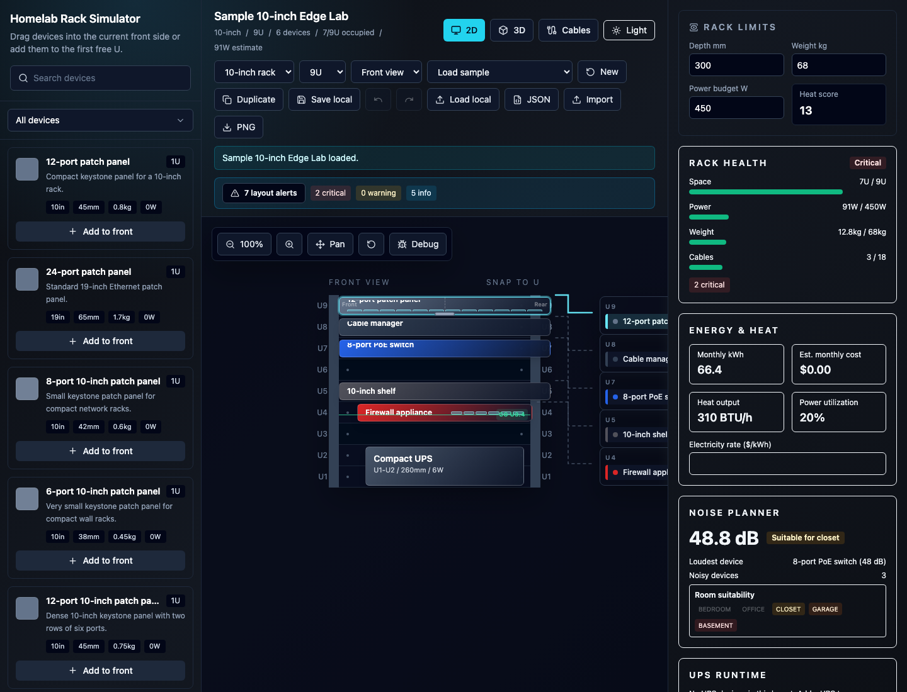
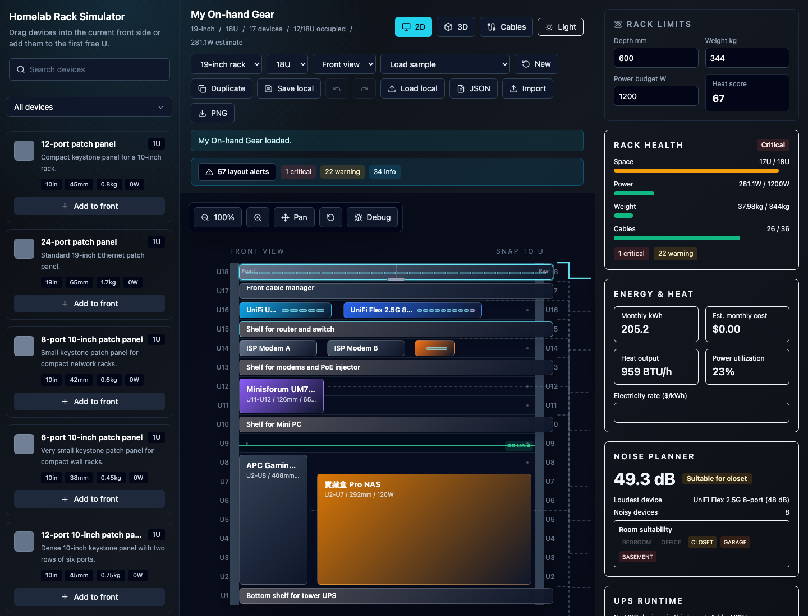
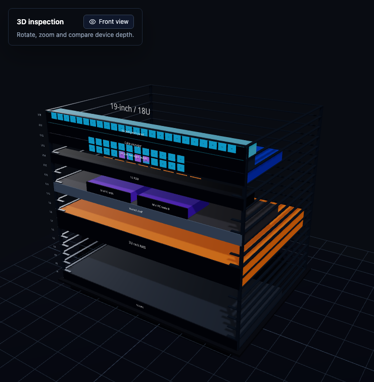
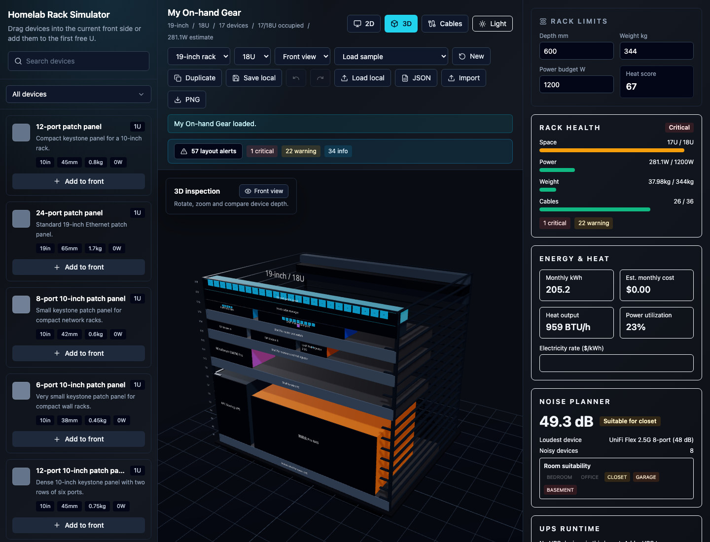
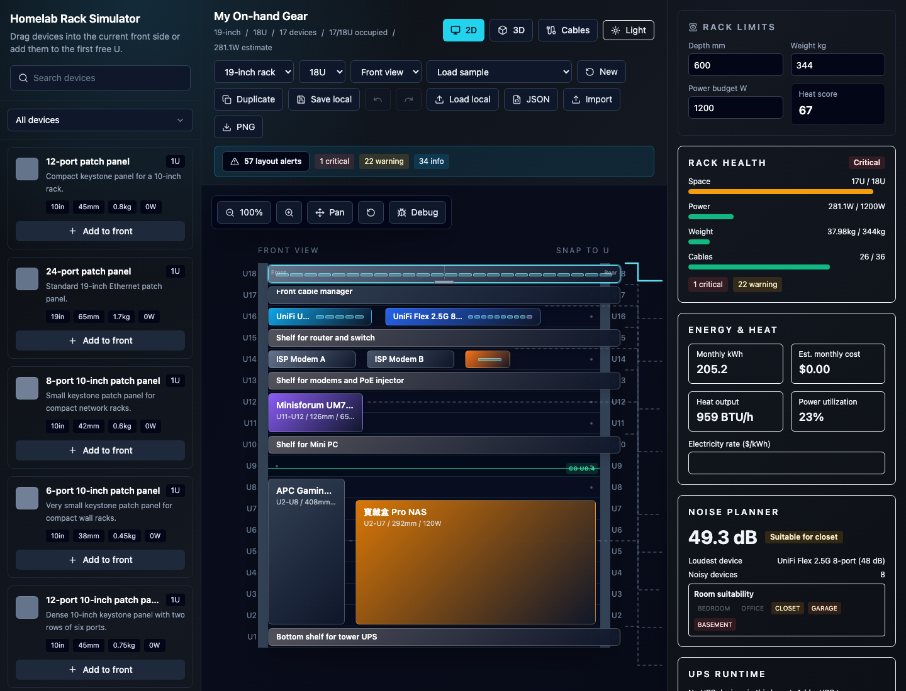
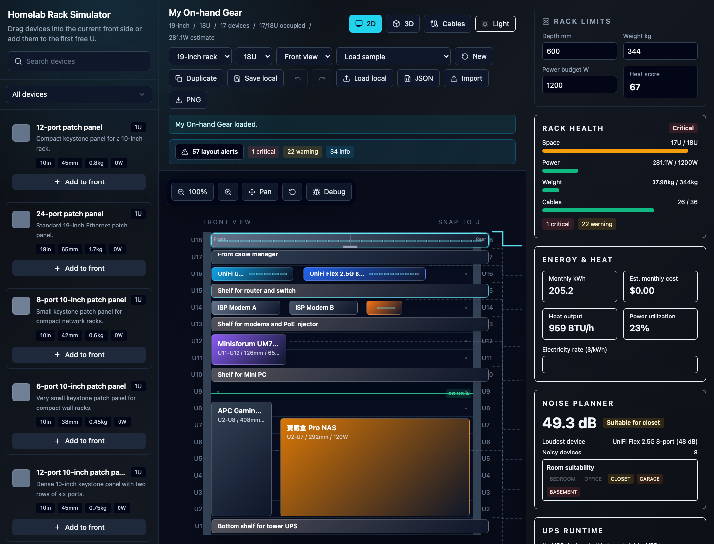
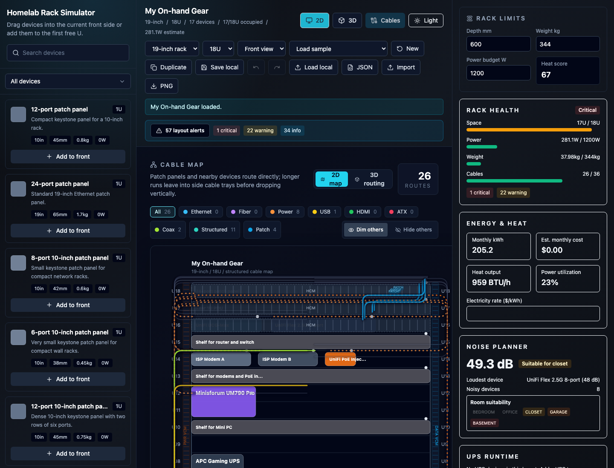
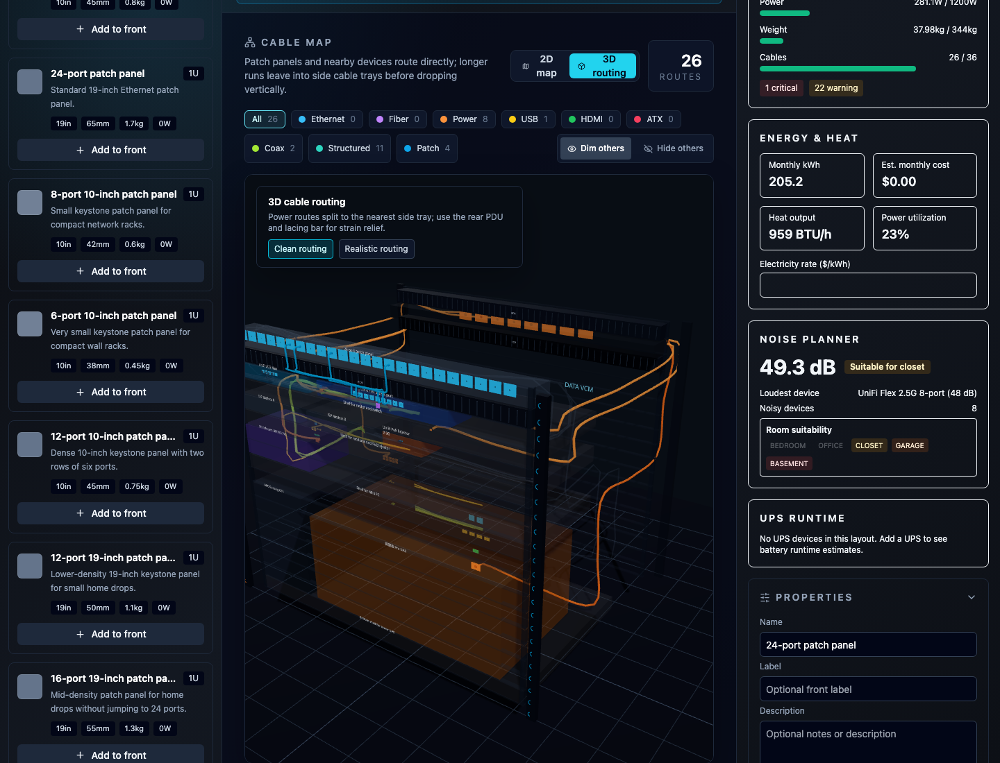
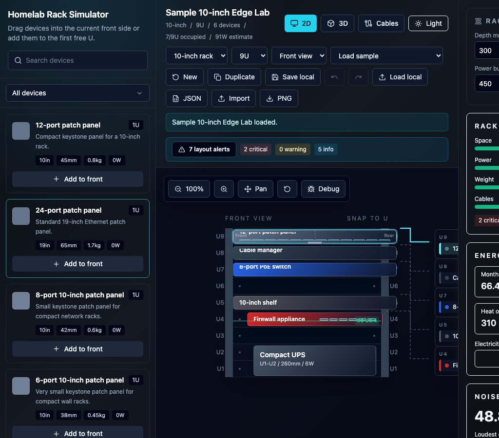

# Homelab Rack Simulator

> Interactive React prototype for planning 10-inch and 19-inch homelab rack layouts before buying or moving equipment.

---

## Overview

Plan your homelab rack layout in 2D, inspect it in 3D, and map every cable — all in the browser with no backend required. The simulator includes a growing library of community-inspired hardware templates, validation warnings for real-world constraints, power/noise/runtime planning panels, and full JSON import/export so you can share and iterate on layouts.

---

## Screenshots

### 2D Rack Editor

Drag devices from the library, snap them to U slots, and manage properties in real time. Overlap prevention and multi-device shelf sharing are built in.





---

### 3D Inspection View

Rotate, zoom, and compare device depth. The 3D renderer uses approximate dimensions for quick visual validation before you commit to hardware.





---

### Hardware Template Library

90+ built-in templates covering TinyMiniMicro nodes, Mini-PCs, switches, routers, firewalls, NAS, UPS, PDUs, patch panels, KVMs, access points, modems, SBCs, cable-management parts, and more. Filter by category and add to your rack in one click.



---

### Cable Routing & Map

Plan tray-style routed paths for Ethernet, power, fiber, USB, HDMI, ATX, and coax. The Cable Map gives you a dedicated view to trace connections without cluttering the rack editor.







---

### Mobile Responsive

The layout library and property panels adapt to narrower viewports so you can check or tweak your rack on the go.



---

## Features

| Feature | Description |
|---------|-------------|
| **Rack Sizes** | 10-inch and 19-inch rack widths; heights from 2U to 45U |
| **2D Editor** | Front/rear views, U numbering, drag-and-drop, snap-to-U placement, overlap prevention |
| **Shelf Sharing** | Multiple shelf-mounted devices can share the same U when their horizontal footprints fit |
| **Side Labels** | 1U and narrow devices show side labels so names remain readable when tiles are cramped |
| **Device Properties** | Size, depth, width type, weight, power draw, heat level, color, and port counts |
| **Port Layout Columns** | Realistic front-panel planning — e.g. a 24-port patch panel in one row |
| **Validation Warnings** | Width, overlap, depth, rack weight, UPS placement, heavy devices, heat clustering, airflow, and power budget |
| **Rack Health Panels** | At-a-glance utilization, energy cost, noise estimate, UPS runtime, depth compatibility, serviceability, and documentation audit |
| **Power Chain Planning** | Model UPS/PDU/device power relationships and trace load paths |
| **Cable Trace** | Inspect endpoint-to-endpoint cable runs, including patch, structured cabling, power, fiber, USB, HDMI, ATX, and coax |
| **Cable Map** | Dedicated tab with tray-style routed paths per cable type |
| **3D Inspection** | Approximate rack and device dimensions with full camera control |
| **Save / Load / Export** | Local storage, JSON import/export, and PNG export of the 2D diagram |
| **Seed Layouts** | Compact 10-inch edge lab, on-hand device layout, 4-zone routing test layout, and a 19-inch home cloud rack to get started |

---

## Tech Stack

- **React 18** with TypeScript
- **Vite** for dev and production builds
- **Zustand** for client-only state management (undo/redo + localStorage persistence)
- **React Three Fiber / Three.js** for 3D views (lazy-loaded to keep initial bundle small)
- **Tailwind CSS** for styling
- **Vitest** for unit and store regression tests
- **Playwright** for smoke screenshots and browser-level checks

---

## Quick Start

```bash
npm install
npm run dev
```

Open the Vite URL shown in the terminal, usually:

```text
http://127.0.0.1:5173/
```

Build a production bundle:

```bash
npm run build
```

Run the regression suite:

```bash
npm test
```

Refresh the cable-routing screenshots after starting the dev server:

```bash
npm run smoke:cables
```

---

## Project Structure

```text
App.tsx (toolbar + view switcher)
  ├─ ComponentLibrary       ← drag source — device templates
  ├─ RackEditor2D           ← reliable 2D editor
  ├─ RackViewer3D           ← React Three Fiber scene (lazy)
  ├─ CableViewer3D          ← 3D cable routing (lazy)
  ├─ CableMap               ← tray-style cable map
  ├─ PropertyPanel          ← selected device editor
  ├─ CablePlanner           ← cable connection editor
  ├─ CableTracePanel        ← endpoint trace detail
  ├─ PowerChainPanel        ← UPS/PDU/device power path checks
  ├─ RackHealthDashboard    ← rack utilization summary
  ├─ Energy / Noise / UPS   ← operating-cost, acoustic, runtime panels
  └─ ValidationPanel        ← constraint issues
           │
           ▼
    useRackStore (Zustand)  ← all mutations, undo/redo, localStorage
           │
           ▼
    src/utils/*             ← pure functions: rackMath, portLayout,
                              routing, validation, exporters, powerChain
```

### Key Files

| File | Purpose |
|------|---------|
| `src/types/rack.ts` | Data models: `RackLayout`, `PlacedDevice`, `CableRoute`, `PortLayout` |
| `src/data/deviceCatalog.ts` | 60+ reusable device templates shown in the left sidebar |
| `src/data/sampleLayouts.ts` | Seed 10-inch and 19-inch layouts |
| `src/store/rackStore.ts` | Layout state, mutations, undo/redo, localStorage persistence |
| `src/utils/rackMath.ts` | Rack dimensions, snapping, overlap, free-space helpers |
| `src/utils/portLayout.ts` | Port positioning per device face (consumed by 3D and cable routing) |
| `src/utils/routing.ts` | Cable path nodes and tray-style routing logic |
| `src/utils/validation.ts` | Layout validation rules and rack totals |
| `src/utils/powerChain.ts` | UPS/PDU/device load path analysis |
| `src/utils/upsRuntime.ts` | Runtime estimates for UPS-backed load |
| `src/utils/serviceability.ts` | Rear/front access and maintenance clearance checks |
| `src/utils/documentationAudit.ts` | Documentation and labeling completeness checks |
| `src/components/RackEditor2D.tsx` | 2D editor with drag/drop and snap |
| `src/components/RackViewer3D.tsx` | React Three Fiber scene loader |
| `src/components/CableMap.tsx` | Cable map tab and routed SVG trace view |
| `src/components/CableViewer3D.tsx` | Lazy-loaded 3D cable routing scene |
| `src/components/three/RackModel.tsx` | Rack frame geometry |
| `src/components/three/DeviceModel.tsx` | Device geometry and port squares |

---

## Adding New Device Types

Add a new `DeviceTemplate` object to `src/data/deviceCatalog.ts`.

Important fields:

- `category`: one of the supported device categories in `src/types/rack.ts`
- `defaultU`: default rack height in U
- `rackMountable`: set to `false` for external gear (e.g. ceiling APs) that should remain in the library but cannot be placed inside the rack
- `depthMm`: approximate device depth for validation and 3D
- `widthType`: `10in`, `19in`, `shelf` or `custom`
- `customWidthMm`: required for custom-width or shelf-mounted devices when you want realistic fit checks
- `xMm`: optional placement field on saved devices; left offset inside the usable rack width
- `weightKg`, `powerW`, `heatLevel`: used by validation
- `ports`: optional front port counts for 2D/3D hints. Use `layoutColumns` to control front-panel wrapping
- `color`: used in both 2D and 3D

Example:

```ts
{
  id: 'my-lab-node',
  category: 'mini-pc',
  name: 'Lab node',
  defaultU: 1,
  depthMm: 140,
  widthType: 'shelf',
  customWidthMm: 130,
  weightKg: 0.9,
  powerW: 28,
  heatLevel: 3,
  ports: { ethernet: 2, usb: 4, power: 1, layoutColumns: 2 },
  color: '#0891b2',
  description: 'Shelf-mounted compute node.'
}
```

The left library, 2D editor, validation system, JSON export, and 3D viewer will pick it up automatically.

---

## Template Research Notes

The included hardware templates are **planning profiles**, not CAD-accurate models. Dimensions, power, and weights are rounded for layout validation and rough airflow/power planning.

Reference sources used for the built-in popular hardware set:

- ServeTheHome Project TinyMiniMicro coverage for Dell Micro, HP Mini, and Lenovo Tiny class homelab nodes: https://www.servethehome.com/introducing-project-tinyminimicro-home-lab-revolution/
- Minisforum MS-01 official specifications: https://store.minisforum.com/products/minisforum-ms-01
- Protectli Vault VP2420 specifications: https://eu.protectli.com/product/vp2420/
- MikroTik CRS305 specifications: https://mikrotik.com/product/crs305_1g_4s_in
- Ubiquiti UniFi Dream Machine Pro tech specs: https://techspecs.ui.com/unifi/cloud-gateways/udm-pro
- Ubiquiti UniFi Cloud Gateway Max tech specs: https://techspecs.ui.com/unifi/cloud-gateways/ucg-max
- Ubiquiti UniFi U7 Pro tech specs: https://techspecs.ui.com/unifi/wifi/u7-pro
- Ubiquiti 2.5G PoE+ Adapter tech specs: https://techspecs.ui.com/unifi/accessories/uacc-poe-plus-2-5g
- Ubiquiti UniFi Flex 2.5G 8-port switch tech specs: https://techspecs.ui.com/unifi/switching/usw-flex-2-5g-8
- Minisforum UM790 Pro official specifications: https://store.minisforum.com/products/minisforum-um790-pro
- Synology DS923+ product specifications: https://global.download.synology.com/download/Document/Hardware/ProductSpec/DiskStation/23-year/DS923%2B/enu/Product_Spec_DS923%2B_enu.pdf
- APC 1U Smart-UPS product families: https://www.apc.com/us/en/product/SCL500RM1UC/
- APC Back-UPS Pro Gaming BGM1500B-US product page: https://www.apc.com/us/en/product/BGM1500B-US/apc-backups-pro-for-gaming-1500va-900w-tower-120v-10x-nema-515r-outlets-rgb-lights-pure-sine-wave-midnight-black/
- Sipeed NanoKVM documentation: https://wiki.sipeed.com/hardware/en/kvm/NanoKVM/introduction.html
- Sipeed NanoKVM PCIe documentation: https://wiki.sipeed.com/hardware/en/kvm/NanoKVM_PCIe/introduction.html
- JetKVM documentation and specs: https://jetkvm.com/docs and https://jetkvm.com/products/jetkvm
- 寶藏盒 Pro NAS planning dimensions came from the user-provided product image.
