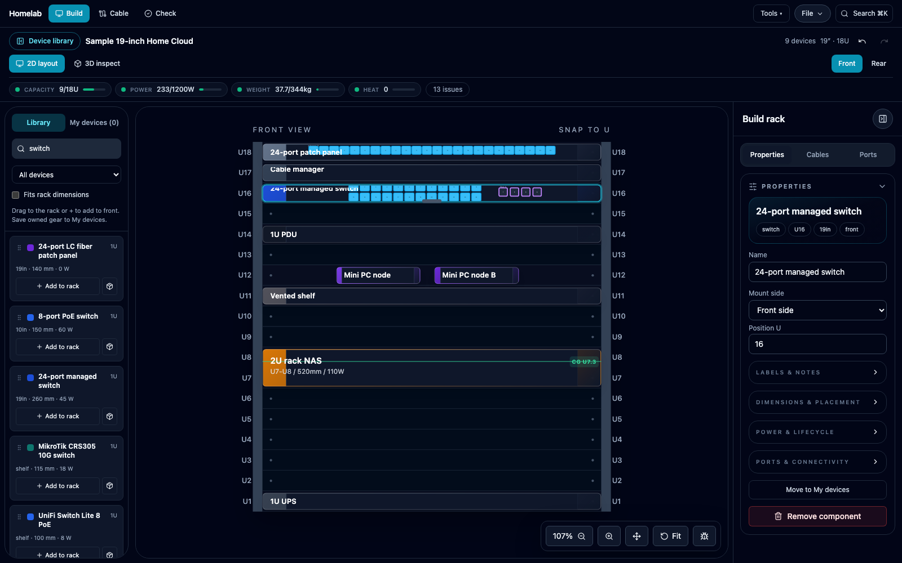
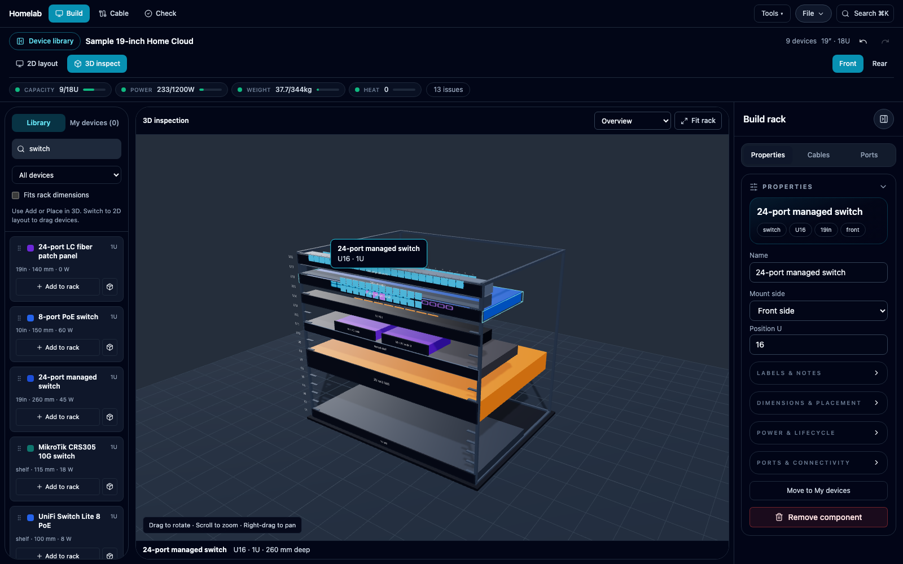
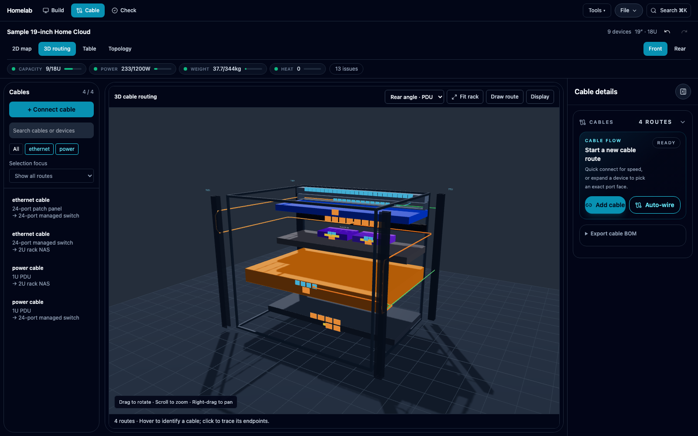
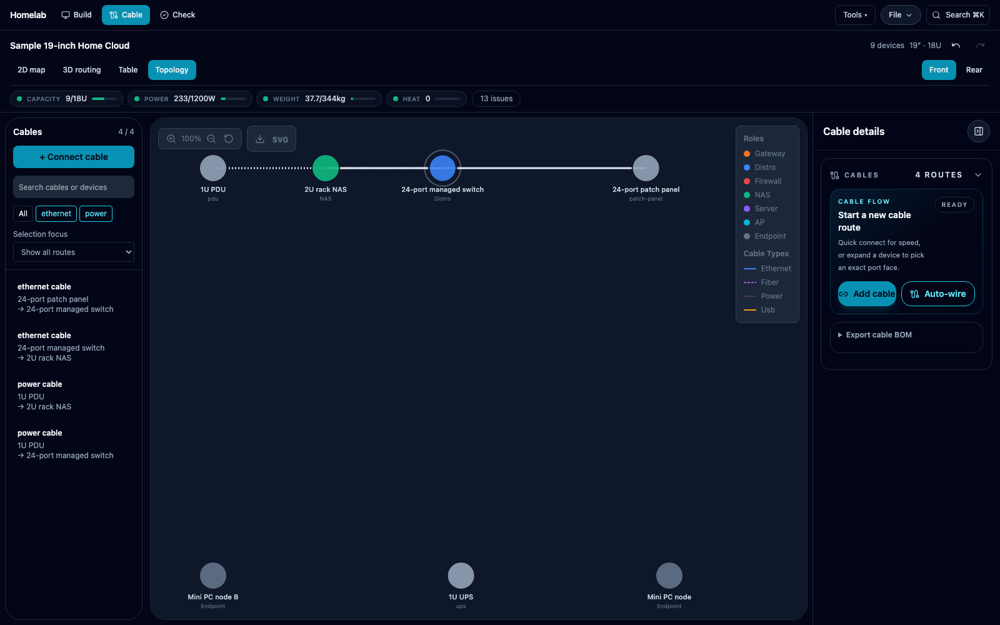
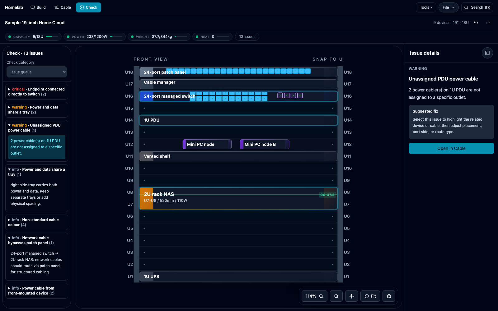
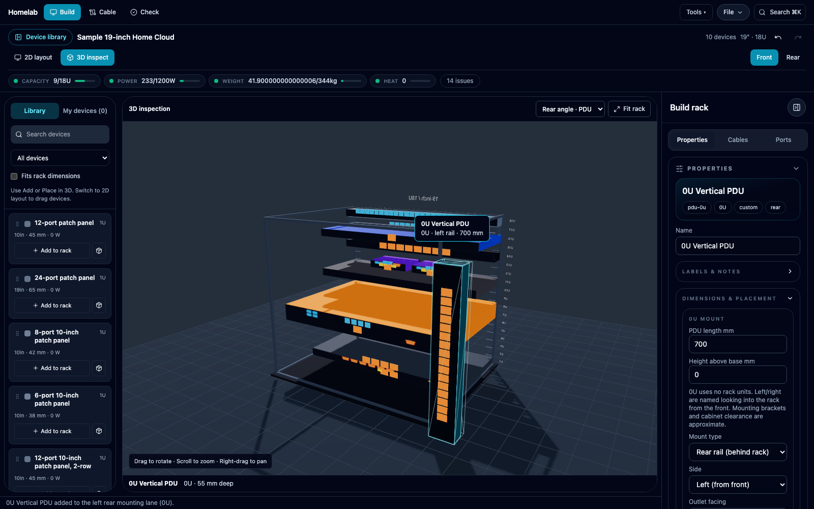
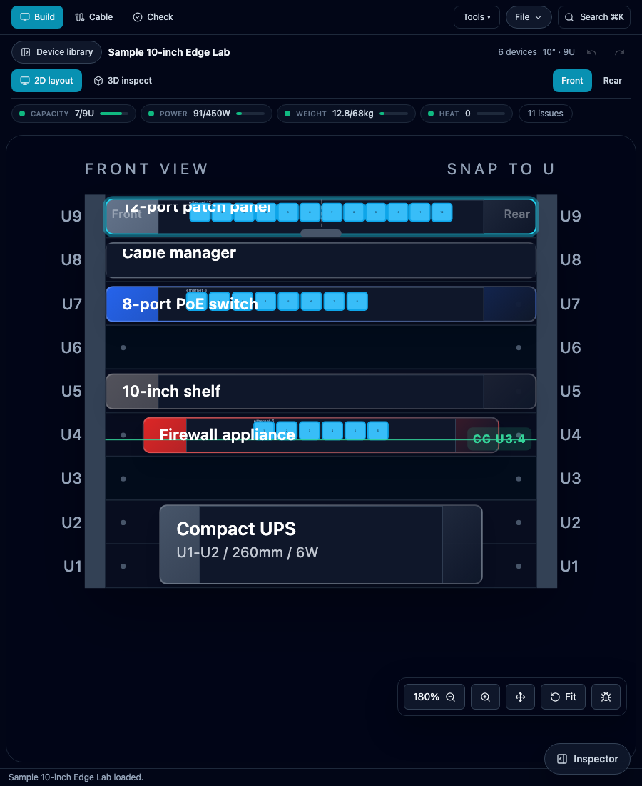

# Screenshot tour / 截圖導覽

Captured **2026-09-18** from the local working tree, not the deployed site. Desktop images use 1600 × 1000; the tablet example uses 900 × 1100. These are real application screenshots, not mockups.

所有畫面都由本機程式擷取，使用獨立 Chromium 同範例資料，冇使用個人瀏覽器嘅已儲存佈局。範例警告保留原樣；截圖唔代表實物安裝驗證。

[English guide](USER_GUIDE.md) · [繁體中文指南](USER_GUIDE.zh-Hant.md) · [README](../README.md)

## Build · 2D layout

Bundled 19-inch Home Cloud with a library search and selected switch properties.

內置 19 吋 Home Cloud，展示設備搜尋同交換器屬性。



## Build · 3D inspect

The same rack in 3D, showing device depths, sockets and a selection label.

同一機架嘅 3D 深度、插口同選取標示。



## Cable · 2D map

Data and power connections with the cable list and connection controls.

線材清單旁邊顯示資料線及電源線。


## Cable · 3D routing

Rear-angle inspection of the sample connections.

從後方角度檢查範例連線。



## Cable · Topology

Logical device connections; this is not a physical cable route.

設備嘅邏輯連接關係，唔代表實際走線路徑。



## Check · Issue details

A selected PDU outlet assignment issue; sample warnings are retained.

選取 PDU 插座分配問題，保留範例原有警告。



## Build · My devices

Two catalog devices added to unplaced inventory; installed totals remain separate.

將兩部 catalog 設備放入未上架庫存，唔計入已安裝設備總量。


## Tools · Plugins

The plugin manager exposes default workflows and optional packs.

插件管理顯示預設功能同可選功能包。


## Build · Thin tray

Focused 8U example: a 52.3 mm Mini PC, 10 mm clearance and a thin tray share starting U3.

8U 示範：52.3 mm Mini PC、10 mm 淨空同薄托盤共用起始 U3。


## Build · 0U PDU

Bundled Home Cloud plus a catalog vertical PDU, selected in the rear-angle 3D view.

Home Cloud 範例加垂直 PDU，喺後方 3D 視角選取檢視。



## Cable · Draw route

Focused two-server example with two channel anchors and a destination preview before saving.

兩部伺服器示範：兩個線槽理線點同儲存前終點預覽。


## Responsive · Tablet

900 × 1100 viewport with the bundled 10-inch Edge Lab; panels adapt to the narrower screen.

900 × 1100 平板畫面，使用 10 吋 Edge Lab 範例。



## Refresh the captures

Start the development server in one terminal:

```bash
npm run dev
```

Then run from the repository root:

```bash
npx playwright install chromium  # First-time setup only
node scripts/capture-docs.mjs
```

The script uses disposable browser contexts, bundled sample layouts and small illustrative fixtures, and writes PNGs plus [capture metadata](images/capture-manifest.json) to `docs/images/`. It exercises the shown controls and checks for uncaught page errors/runtime overlays. It is a screenshot workflow, not the full regression suite.

Optional environment variables: `DOCS_URL` overrides the Vite app URL (including its base path); `DOCS_OUT_DIR` chooses another output directory. The script relies on the development store hook and Vite source imports, so it does not target a production deployment. Review every resulting image before replacing published documentation; the capture timestamp alone does not establish visual quality.
