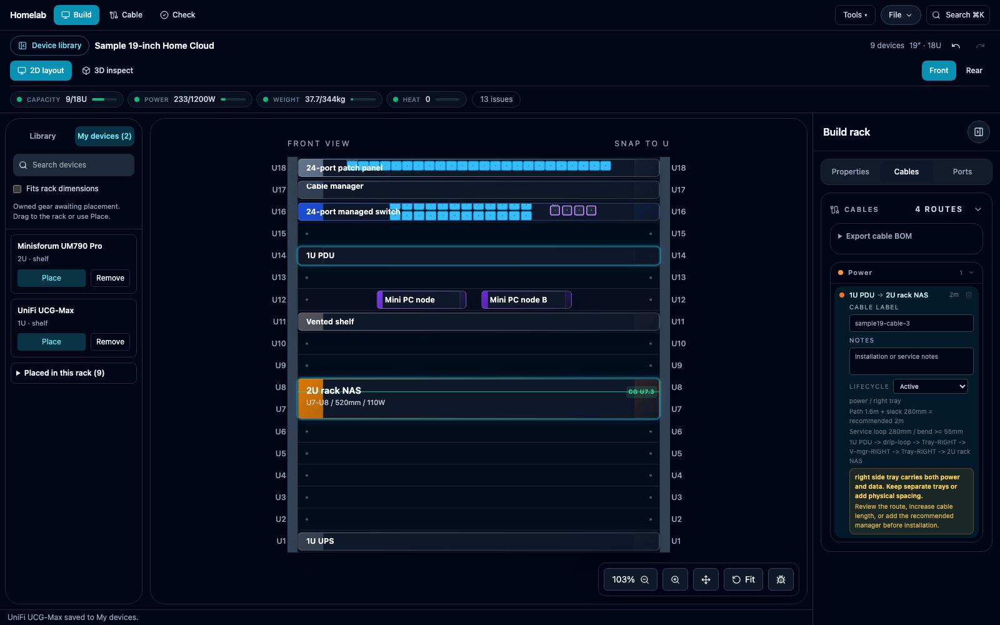
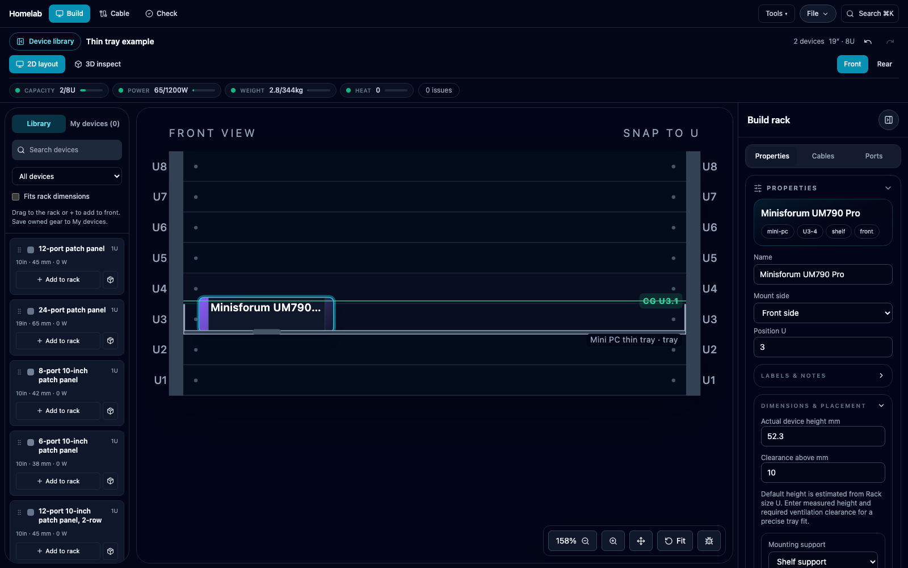
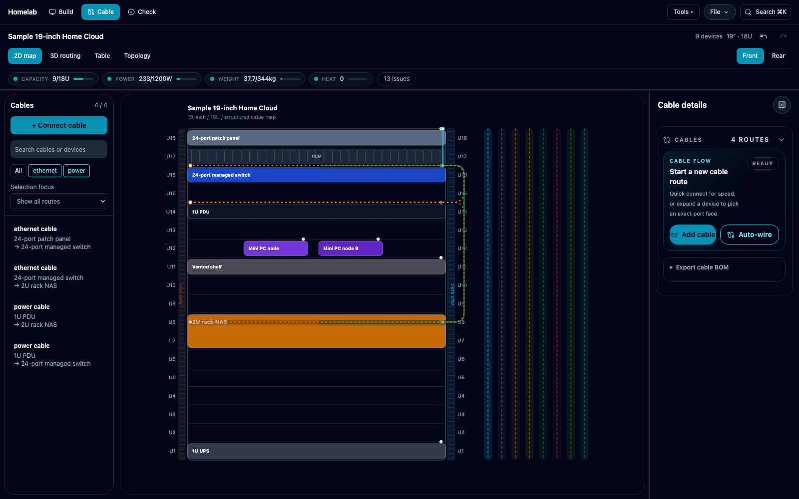
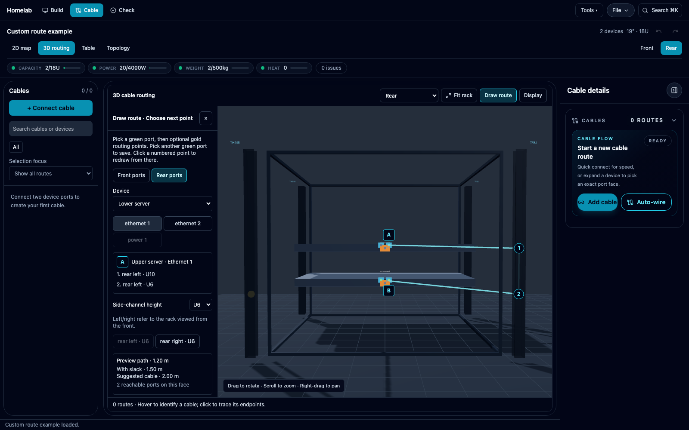
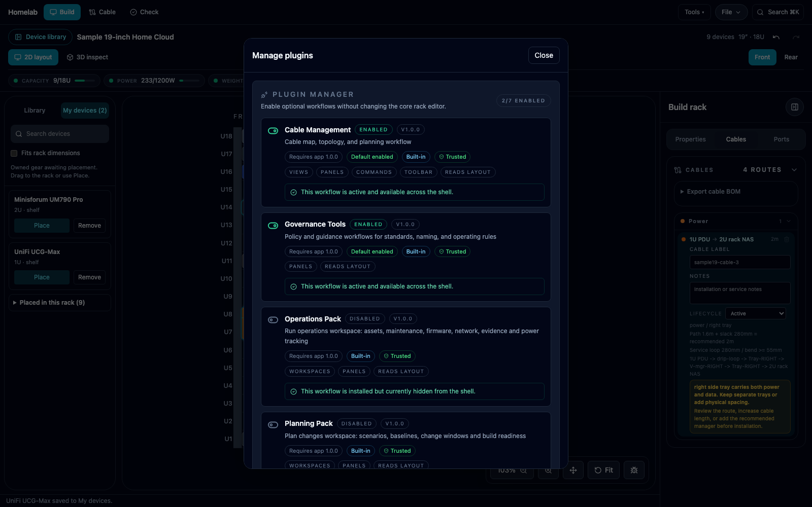

# User guide

Current working-tree workflows, reviewed 2026-09-30. [繁體中文](USER_GUIDE.zh-Hant.md) · [Overview](../README.md)

Screenshots below were captured from the local app on 2026-09-18 using example data. [Complete visual tour](SCREENSHOTS.md).

## Learning examples and a safe first start

A browser with no saved workspace starts with **Start small: one feed / 入門：單路供電小機架**, a 6U 10-inch generic router, switch and distribution plan. Its single-supply, optional recovery and disconnect-before-moving goals are explicit. Spare sockets are intentionally idle. Existing workspaces, legacy saved layouts and recoverable invalid backups are preserved; the starter does not replace them.

Use **Create → Load sample layout** to choose among three learning examples:

- **Start small: one feed** teaches socket faces, intended connections and sensible single-feed goals.
- **Trace A/B and patch paths** uses a 14U 19-inch rack to demonstrate separate recorded A/B circuits and PSU inlets, complete front/rear patch pairs, rails and service dependencies.
- **Repair three conflicts** is a deliberately broken copy of the advanced example. Its guide explains the three root causes and remedies: power budget, both server feeds using A, and a declared cable shorter than its modeled route. It is never the startup example.

Summary buttons show **Confirmed issues**, **Needs verification**, **Optional information** and **Accepted exceptions**, counting root causes rather than raw severities. Select a button to open that section in Check; the raw-severity filters and individual heuristic details remain available. For example, the advanced sample has zero confirmed or prerequisite-review causes even though some optional routing checks retain a raw warning severity.

The four original layouts remain under **Legacy examples**. Every explicit sample load asks before replacing the active rack, including an empty rack with edited settings or records; Cancel leaves it unchanged. Other workspace racks are retained. Loading the same sample again restores the original example values.

The compact **Example guide & assumptions** stays with an example-derived plan across reloads and JSON backup/restore. All new devices and their dimensions, loads, socket identities, kits and supply ratings are fictional teaching inputs. A clean Check result means consistency within those stated assumptions; it does not establish manufacturer specifications, site circuit independence, physical fit, electrical safety or service failover. Replace the assumptions with evidence before purchasing. The examples use ordinary validation, and missing or changed evidence still needs review.

## Build your rack

1. Open **Build**. Use **Tools → Settings → Rack settings** to configure the rack.
2. Search **Library** for a template. **Fits rack dimensions** checks dimensions, not whether an empty slot is available.
3. Drag into the 2D rack or use Add. Green previews can be placed; red previews identify blocking geometry/reservations; amber indicates a depth warning. Press Esc to cancel a drag.
4. Select equipment and edit **Properties**. Switch Front/Rear to inspect the other face; switch to 3D to inspect depth and sockets.
5. Open **Check** to review the resulting issues.

**My devices** is the active rack's unplaced inventory. Adding there does not consume rack U space, power or weight. Drag/Place preserves device identity and metadata. Disconnect rack and inter-rack cables before returning installed equipment to inventory. External equipment can be recorded but cannot be placed inside the rack. Automatic placement searches available space and skips reservations.

The library and inspector become drawers on smaller screens. Close a drawer to regain canvas space; the cable list drawer closes before connection picking.

*My devices keeps owned equipment separate from the installed rack.*

## Shelves and printed mounts

For a thin shelf, select it and choose **Properties → Dimensions & placement → Shelf placement → Thin tray — share U with devices**. Old layouts keep **Separate U** until you change them.

Place supported equipment at the same starting U and mounting face. Check shelf depth, load limit, at least 3 mm at each side, plate thickness/offset and the device's **Actual device height mm**, **Clearance above mm** and **Rack size U**. A zero load limit means unspecified. Without actual height the app uses an approximate U-derived height.

Example: a 2 mm tray at U15, a 52.3 mm Mini PC and 10 mm clearance fit within a device set to 2U starting at U15. The assembly occupies U15–U16. Side-by-side equipment may share that envelope; overlapping equipment cannot. Moving/removing a shelf does not move its equipment automatically; Check reports lost support.

*Illustrative 8U rack: the thin tray and 2U Mini PC share U3; this is a focused example, not the default layout.*

For a printed bracket, select the device and choose **Properties → Dimensions & placement → Mounting support → 3D-printed rack mount**. Save a reference in **Printed mount model URL** if useful. Position and cables remain, and the shelf requirement is replaced by printed support. Existing shelves stay in place. Switching back to **Shelf support** restores shelf checks.

Both 3D views show simplified brackets; devices sharing face and starting U can form a modular panel. This does not create a printable model, validate a downloaded model, reserve its extra physical clearance or add its geometry as a routing obstacle.

## 0U PDUs and 3D navigation

Search Library for a 0U PDU. Its **PDU length mm**, **Height above base mm**, **Mount type**, **Side** and **Outlet facing** determine placement. It consumes no normal U slots but must fit its physical lane without overlap. Left/right is viewed from the rack front. See [the PDU guide](0U_PDU.zh-Hant.md).

In 3D, drag to rotate, scroll to zoom and right-drag to pan. **Camera view** offers Overview, Front, Rear, Rear angle · PDU, Top, Left and Right; **Fit rack** restores rack framing. Selecting equipment or a cable provides focused inspection.

## Connect and inspect cables

Open **Cable** for the cable list and **2D map**, **3D routing**, **Topology** or **Table**. Cable Management is enabled by default; if the workflow is unavailable, check **Tools → Settings → Manage plugins**.

Use **+ Connect cable** for the guided connection flow. Choose a device, switch between its front/rear diagrams, and click a socket. Socket colors and shapes identify LAN, USB, HDMI and other types; hover or keyboard focus reveals its exact identity. Use zoom or the numbered **Port list** for dense devices. Unavailable source devices are grouped separately with their reasons. The connection panel scrolls internally to leave room for the route preview. Occupied and incompatible sockets are marked. Select the destination, review both endpoints, then **Connect cable**. **Keep connecting from this device** returns to the source device for the next cable. Cancel creates no cable. The same endpoint selection also works in 3D.

Diagrams use the shared schematic port geometry, so positions may differ from the physical product. Compatibility currently checks the port family and availability; connector subtype and signal direction still require checking against the actual devices. Select an existing cable to inspect its endpoints and routing information; list filters help isolate connections.

In 3D, **Clean** emphasizes clear routing geometry. **Realistic** can add slack when it remains clear. A blocked/review state means the route needs attention; it is not hidden behind a plausible-looking cable. Support clips and harnesses are planning aids, not automatic inventory additions.

The 2D map is a routing schematic; automatic 3D routing can choose a different clear path. Purchasing lengths now use one shared calculation: the longer rendered Clean/Realistic centreline plus the discipline's installation-slack allowance, rounded up to a stocked length. Cable list, Table, patch-panel labels, completed drawing preview, Check, BOM CSV/Text and the procurement checklist use this same requirement. Service-loop/bend notes describe planning allowances, not additional lengths to add again. Treat these as installation estimates, not measurements for cutting cable.

Select a cable in **3D routing** to see the current style's **3D centreline** and the shared **Purchase length**. Each display axis is converted back to physical millimetres; centreline length excludes extra installation slack. Switching style does not change the purchase recommendation. Blocked or missing routes stay in the BOM as **Not estimated — route needs review**. Requirements above the stocked-length table show **Custom length ≥ …** instead of recommending a too-short maximum stock length. Recorded cable length remains unchanged; Check reports insufficient length against the shared requirement.

**Check Health → Serviceability → Inspector** checks connected-cable maintenance allowance when the service motion goal is **Move equipment with cables attached**; unspecified motion leaves the estimate as optional information. It compares your recorded actual cable length with the longer 3D centreline plus one device's chassis depth and an allowance of at least 300 mm (or the larger routing allowance). Chassis depth is an assumed travel distance, not measured rail travel. Missing actual cable length, unresolved routes or missing depth remain unverified; the purchasing recommendation is not substituted for an installed cable measurement. Cable arms, release points and moving clearances still require confirmation. Purchasing length covers the installed route; connected pull-out service may require extra length or disconnecting cables first.

In **Tools → Planning → Build**, saved cable purchases are matched against the current length group, quantity and route members. Adding or removing a route, or changing its required length group, does not automatically carry the earlier group's ordered/owned status into the new requirement. Previous records remain visible with their saved status and notes under **Previous cable requirement**; they are excluded from current requirement totals. Review whether an existing purchase can be reused before updating the current requirement's status. The current calculation is shown separately from editable notes. Procurement CSV/Text includes the same review message and calculation; full workspace backups retain saved records.

## Draw or redraw a route

1. Open **Cable → 3D routing → Draw route**, or select a cable and choose **Redraw route**.
2. Select an available source port on the required face. Green indicates available choices; unavailable ports are grey.
3. Select a compatible destination directly, or add gold routing points on side channels/existing cable managers first.
4. Review the preview and estimated length. Selecting a valid destination saves after compatibility, occupancy and clearance checks.

**Backspace / Step back** removes the last point; at the beginning it clears the source. **Esc / Cancel drawing** discards the draft. Selecting an earlier routing point lets you redraw the remaining section. A/B mark source and preview destination.

Saved anchors refer to channels/managers rather than fixed world coordinates. They follow geometry changes; a missing manager or new obstruction produces a blocked route requiring review. Redrawing retains the original cable's identity and metadata; cancelling leaves it unchanged.

*Two-server example showing the draft before saving, not a completed connection.*

On desktop, drag the device-library divider or focus it and use the Left/Right arrow keys to adjust its width. Search recognizes category names and spacing variants such as **mini pc**, **mini-pc**, and **minipc**. Exact names/models and category matches rank ahead of incidental description matches; similarly relevant devices that fit the rack dimensions appear first. The explicit **Fits rack dimensions** filter still excludes incompatible results.

### Connect final devices through patch panels

Use **Connect A–B · 經配線架** in Cable. Choose the final Ethernet devices and numbered sockets, then preview a direct path or a path through one or two existing panels. Candidates show each **new planned cable**, **reused physical cable**, and **internal front ↔ rear jack hop**. Internal hops are not cables and never add BOM purchases. Existing trunks keep their socket numbers, including a Panel 1 rear #3 → Panel 2 rear #7 connection.

New segments explicitly declare patch-cord (panel front) or permanent-link (panel rear) intent. A server may use an explicit front patch cord, enabling Server → Panel 1 front #3 → existing rear #3/#7 backbone → Panel 2 front #7 → Switch. Old cables retain inferred roles and findings. Contradictory or malformed explicit roles are rejected; the planner never joins different switch ports internally. Occupied sockets can only follow their existing cable. Reserved sockets, inter-rack claims, missing sockets and known connector/media conflicts are excluded. Unspecified connector information remains unverified; speed differences alone do not mean a physical mismatch. This plans physical connections, not Ethernet operation, VLAN configuration or routing.

Confirm adds all missing segments atomically as **planned**, with one Undo for the whole connection. Repeated confirmation and saved/reloaded existing paths do not add duplicate cables. A changed preview must be refreshed before confirmation. Estimates are per physical segment and never overwrite recorded measured or purchased lengths. Search is deterministic and bounded to two panels, 16,000 topologies per path mode, 128 jacks per panel and a shortlist of 24 paths before clearance checks; at most five candidates are displayed. A limit message means the result is not exhaustive.

### Tidy panel routing without rewiring

Choose the panel and press **整理走線 · Tidy routes**. The shared route engine looks for clear direct or side-channel routes that reduce projected crossings or shorten an equal-crossing route. Only that panel's cables are considered. Device/socket IDs, port indices, faces, cable IDs, labels, lifecycle status and recorded physical lengths stay fixed. User-drawn manual routes remain untouched; generated tidy anchors are tracked separately.

Clearance is checked in both Clean and Realistic modes. The result settles before a single store update, so repeat clicks are stable and one Undo restores all routing changes. Computed length requirements and BOM recommendations follow the changed route. If no improvement is found or a route is blocked, the result says so and retains the original route. Tidy is bounded to 128 panel cables and 32 settling passes; a limit failure applies no routing changes. Crossing and clearance checks are approximate planning geometry, not verification of the actual installation.

## Checks and optional tools

**Check** presents a queue of root causes for capacity, weight, power, heat, depth, support and serviceability. The header, summary popover and health chips use the same grouping. **Issues to address** contains recorded conflicts; **Needs verification** contains missing evidence for applicable checks. **Information & optional checks** and **Accepted exceptions** remain available under **All checks & accepted exceptions**. One cause can contain several raw checks: expand it to inspect each result, assumption and affected device or cable. Severity describes impact; unknown means the evidence cannot establish a pass or a conflict. A real recorded conflict remains actionable even when an optional planning mode is selected.

Open **Planning goals** in the Check inspector to specify rack requirements. Existing layouts keep neutral defaults until you choose otherwise; selected devices can override each default. **Single supply is sufficient** does not require a second PSU cable. **Independent A/B supplies required** checks recorded upstream paths, separate PSU sockets and circuits, rather than the physical left/right side of a PDU. Missing socket or circuit evidence needs verification; an enabled Dual PSU Circuit Split policy still applies. Idle optional data and management ports do not create connectivity warnings. **Recovery access required** asks you to document and test the recovery method; spare Ethernet ports and an IP-KVM alone cannot prove remote recovery.

For service motion, **Disconnect cables before removal** removes connected-travel checks. **Move equipment with cables attached** checks a conservative travel allowance. **Not specified** retains the assumptions as optional information. Chassis depth remains an assumed travel distance, not measured rail travel; installed cable length, cable arms, release points and clearance still require confirmation.

Select a check to inspect its facts and use **Edit device**, **Edit cable**, or **Adjust rack settings**. Groups expose all affected targets. **Return to check** restores the queue and filters after editing. If an edit removes a finding, it no longer applies to the recorded data; this does not prove the physical installation is verified.

**Record an accepted exception** requires a reason and records the rule, affected targets and current facts. It moves that cause out of the default action queue while keeping the raw conflict or unknown visible; health indicators still show unresolved conflicts and applicable unknowns. Relevant changes reopen review and retain the previous reason. Restoring the exact original facts, including undo, restores the original acceptance. **Reopen this exception** removes the decision. Duplicated racks require a new review. Rack/workspace JSON backups preserve goals and exceptions; malformed or unsupported new versions are rejected with field-specific errors before replacing the current plan.

Under **Cabling rules**, direct switch connections are allowed for a homelab and reported as suggestions. Choose **Structured cabling — flag direct links** to enable the existing direct-link policy. Existing policy severity is preserved; physical-fit and power checks remain active.

Use **Issue topic → Cables & ports** to focus on cable-related findings. **Inspection view** changes the audit view; it is separate from the topic and severity filters. **Reset issue filters** returns to all topics with actionable conflicts and verification requests. Depth warnings include the additional usable depth needed. Only change configured weight or power limits after verifying the actual equipment ratings; changing a number does not increase physical capacity.

Power socket selections now identify the occupied PDU outlet for usage checks and outlet-failure lookup, regardless of which cable endpoint was selected first. Older outlet-only records still reserve their sockets. If a selected socket disagrees with an older outlet record, Check reports the conflict; review and reconnect that cable to the intended socket before relying on its outlet simulation. This does not verify connector voltage, current rating, polarity or signal direction.

Under **Tools**, Operations, Planning and Fleet show **Enable & open** when needed. Settings includes plugin management. Optional code loads when enabled; a failed load can be retried by disabling and enabling the plugin. Enabled and disabled plugins stay as selected after reload. Legacy preference lists are preserved and checkpointed with a migration version; omitted packs are not silently enabled.

Enable **Port Labels** in plugin management, open its view from Tools/Settings, choose a switch, edit physical labels, then **Save labels**. **CSV** exports its documentation. Unsaved label edits are shown separately from saved rack data.

For printable cable endpoint labels, enable **Cable Labels** in **Tools → Settings → Manage plugins**, then use **Search → Open Cable Labels** (or its view under Tools). Search/filter by device or cable type, and copy a single label or select visible cables for batch copy/CSV. **Two lines** prints one endpoint per line; **Two labels · local end first** produces a reversed pair for the two cable ends. Saved port aliases, port numbers and front/rear faces appear automatically. Missing assignments are marked **Port not assigned**. Batch text can use a blank line or tab separator; printer apps that support CSV import can use one exported row per physical label. If clipboard access fails, a manual-copy field appears.

Fleet exposes rack/room management, inter-rack links and **Export workspace JSON / Import workspace JSON** commands. Use the workspace export for the complete set of racks and their links.

## Save, transfer and recover

The browser autosaves locally. **File → Export JSON / Import JSON** handles the active rack; **Export PNG** creates a 2D diagram. Undo/redo is for the current session and is not preserved as history after reload. Export before replacing important data.

If saving fails, the **Layout recovery** banner says changes are not saved. Choose **Download workspace JSON** before closing or refreshing, then free storage and **Retry save** where offered.

If stored data cannot be read, autosave pauses to avoid overwriting it. Choose **Download original saved data** to preserve the unreadable payload; the current workspace download is a separate snapshot. Keep the original while repairing the data. Do not clear browser storage as the first recovery step.

Reducing rack height can open **Review rack height reduction**. **Cancel** leaves the rack alone; **Resize and retain all data** retains affected records out of bounds. Increase height or reposition them and review Check. Undo is available until reload; retention across reload requires successful autosave.

## Use another device

A development server started with `npm run dev` is accessible on the trusted LAN at `http://YOUR_LAN_IP:5173/HomeLab_Rack_Simulator/`. The address can change with networks. Another browser/device starts with its own storage; transfer rack/workspace JSON explicitly.

### Equipment output ratings and runtime estimates

For each connected UPS output, open **Socket specifications → Socket to specify → UPS outlet backup**. Record **Battery-backed output** or **Surge-only** from the exact model and outlet markings. Unknown or missing socket metadata does not imply battery backup: Check reports it and runtime stays unestimated. Battery estimates and outage paths exclude surge-only outputs; normal utility output load still includes them. This also applies to downstream PDUs and PoE receivers in other racks. Existing layouts need their outlet types recorded; no catalog-wide backup mapping is assumed. Socket metadata survives JSON and local saves. No connected battery-backed load means no rack runtime result, even if the UPS has recorded battery energy.

Select a UPS or PDU, then open **Power & Lifecycle → Rated output capacity (W)** to enter its continuous output rating. Use watts, not VA or socket count. Clearing this field leaves capacity unverified. Existing layouts without this value remain usable and show a Check warning. A supplied rating is user data, not independent verification of the equipment.

Where recorded, **Output rating reference** shows the original watts, exact model/region, source and check date. Editing the current rating preserves that reference and highlights a mismatch; clearing it leaves capacity unknown. The same reference is available in device comparison. Imported reference metadata is a record, not independently authenticated evidence. New SCL500RM1U placements use the 120 V model's 400 W output from the [manufacturer data sheet](https://iportal.se.com/Contents/docs/SCL500RM1U_DATA%20SHEET.PDF), checked 2026-09-29. Its existing 8 W self-load remains an estimate and battery Wh remains unknown; VA and VAh are not substituted for Wh. Existing saved devices are not silently updated from the catalog.

Power-chain circuit summaries show estimated load; they do not establish a breaker limit by adding equipment ratings. UPS runtime uses editable battery assumptions, defaulting to 85% efficiency, 80% usable capacity and 100% starting charge. These are planning assumptions, not measured battery condition; transfer time and discharge curves are not modeled. A passing layout check does not certify electrical installation compatibility.

### Supply direction and outlet failure scenarios

Power cables between a supply and a consumer work in either socket-picking order. For a UPS/PDU connected to another UPS/PDU, select the cable and set **Upstream power supply** in its details. Older cascades retain their first-endpoint direction as an explicitly flagged assumption until confirmed.

Outlet failure compares reachable wired supply paths before and after the selected outlet is removed. Downstream distribution does not become an independent supply after disconnection. Devices still reachable through another path are listed separately. Remaining supply output checks compare each live UPS/PDU against its recorded watt rating, using the full unique reachable planning load without assuming PSU load sharing. Output load excludes that supply’s own consumption but includes downstream distribution consumption. Overloads show the excess watts; missing ratings remain unverified. A within-rating result is conditional on recorded data, not a guarantee of operation. Results do not verify UPS battery hold-up, breaker/cable current limits or actual transfer/trip behavior. Root supplies are assumed live.

Power-chain and circuit loads include the full reachable load for each feed, rather than an assumed 50/50 PSU split. Shared devices count once within a source total but can appear under both A and B. The A/B badge requires distinct documented input sockets and no shared single source whose loss disconnects the consumer; circuit labels remain user-provided assumptions.

### Planning watts and reference conditions

Under **Power & Lifecycle**, **Planning power (W)** is the single editable load used by rack totals, power chains, UPS runtime and energy estimates. The original **Reference** remains visible after editing. Select whether the planning value represents idle, typical operation, a maximum, a measurement or an estimate, and record the hardware/workload or measurement source in the notes.

Confirm **I reviewed this planning load for my hardware and workload** when appropriate. Editing watts, basis or notes clears that confirmation. Unreviewed active equipment produces a Check warning and an amber power summary even below the configured budget. Review means user confirmation, not independently verified accuracy. Passive accessories with zero consumption do not need this review.

Catalog cards label documented power conditions where available. Existing descriptions supplied 61 initial annotations; other values remain unspecified. These annotations preserve existing repository information and are not a fresh manufacturer verification. Idle must not be treated as a peak-load budget; maximum must not be treated as typical energy use. Energy estimates assume the selected planning load runs continuously for 730 hours per month.

### Installation requirements and mounting-post spacing

Select a device and open **Installation requirements** to record required support, the rail kit's minimum/maximum spacing, required rear cable allowance, source/hardware variant, and installed mounting kit or shelf model. Results distinguish a recorded check passing, a requirement not met, and an unverified condition. A kit name records the user's hardware; it does not certify fastener compatibility or load rating.

Open **Check → Inspection view: Serviceability → Depth Compatibility** and enter **Measured mounting-post spacing (mm)**. Measure front-to-rear mounting posts, not cabinet depth or chassis depth. A 300mm-deep chassis can still require a 650–1000mm rail kit. Missing measurements remain unverified; out-of-range results show the required adjustment. Legacy rack rail min/max fields remain in saved files but are no longer treated as equipment rail compatibility. This measurement is used for installation checks; the 3D cabinet remains a schematic representation.

Shelf support requires the full device footprint, adequate shelf depth, the same mounting side, and direct support below the device; a tray can share its mounting U under the existing tray rules. Partial horizontal overlap or a nearby shelf alone is insufficient. Check the shelf/mount load rating separately. Increasing reserved rear allowance reduces usable chassis depth.

### Socket specifications and cable-end fit

Select a device, open its inspector (use **Open inspector** if collapsed), and expand **Socket specifications**. Choose the numbered socket and face; record its exact connector identity, input/output role and specification source. For power sockets, record AC/DC, the configured operating voltage, and DC polarity/pinout where relevant. These are user-entered constraints, not facts inferred from the generic port drawing.

In Cable, choose **+ Connect cable**; on mobile first open **Cable list**. Known conflicts such as two inputs, two outputs, differing AC/DC, operating voltage or DC polarity are blocked, with the reason shown under unavailable devices. Missing specifications remain plannable but the preview explicitly says compatibility is unverified. Free counts are broken down by face and port type; a 24-jack patch panel can show 24 front and 24 rear sockets, not 48 independent jacks.

On desktop, the socket picker uses the Cable work area with the device list beside the port diagram. **Show cable view** switches to the routing preview; **Back to sockets** restores the picker without losing your selected endpoints. The review stage keeps both endpoints, connector status and **Connect cable** available; expand **Review details** to read compatibility assumptions.

After connecting, select the cable and use its details to record the **socket identity each cable end is specified to fit**. This is the socket name from the cable specification, not necessarily the plug's name. Opposite ends can fit different socket types. Recorded name comparisons ignore case and surrounding spaces; they do not infer equivalent names or adapters. A recorded match only confirms the entered constraints. Protocol capabilities, current ratings, grounding, cable quality, adapter conversion and physical inspection remain separate checks. Unspecified legacy connectors are preserved and surfaced in Check, rather than silently marked compatible.

### Compare devices before placing them

In **Device library → Library → Specification filters**, combine maximum U, chassis depth, initial planning watts and minimum Ethernet port count. These filter catalog values; the watt filter is not a maximum-consumption or supply-output guarantee. **Fits rack dimensions** remains a separate check against your current rack. **Clear filters** restores all visible catalog matches.

Tick **Compare** on up to three device cards, then choose **Compare selected**. Selections stay available while you change searches/filters. The comparison shows dimensions, weight, initial planning load, preserved power reference/source, supply output rating, recorded ports/speeds, installation requirements and current rack dimension problems. Missing specifications are shown as unknown or not recorded. Dimension fit does not prove rail/shelf support, free placement space or connector compatibility. On narrow screens, scroll the table horizontally. Close or Escape returns keyboard focus to the comparison button without closing the device library.

### Start a new rack or import a single rack

**File → New rack layout** asks before replacing the active rack, even when it has only settings, unplaced inventory or planning records. **File → Import rack** validates the JSON and previews the incoming rack name and device/cable counts before replacement. Cancel, Close or Escape preserves the current workspace. Other racks remain unchanged; an imported rack receives a fresh identity if its ID belongs to another rack in the workspace. If the current rack changes while an import is being reviewed, the import is cancelled.

Confirmed replacement resets that rack’s undo history and may remove connections to replaced devices. Download a backup first to retain the previous plan. Use full workspace restore for a backup containing multiple racks. Import failures appear in the bottom status area, including on small screens.

### Full workspace backup and restore

Open **File → Workspace backup and restore** in either shell; Fleet is not required. **Download full workspace backup** includes every rack, unplaced inventory, cable and planning record in workspace data. It excludes browser preferences and enabled-plugin settings. **Export rack JSON** is only a single-rack export. Autosave and **Save local copy** are browser-local storage, not separate file backups.

Choose a workspace JSON to preview its rack/device counts. Download the current workspace if you need to keep it, then explicitly confirm replacement and select **Restore workspace**. Closing the preview changes nothing. Restore replaces all racks and resets undo history. Invalid files are rejected; backups with invalid inter-rack connections are rejected rather than silently dropping those links. Keep the original file for repair. When recovery has paused autosave, restoration changes the open workspace only; download it before closing, and preserve the original unreadable saved-data download separately.

### Compare UPS energy against an outage duration

Select the UPS → **Power & Lifecycle → Battery estimate assumptions**. Enter battery energy in Wh (not VA), inverter efficiency, usable capacity allowance for aging/discharge limits and starting charge. Blank percentages use the displayed defaults; zero charge means no stored energy. Missing Wh and zero modeled load show **Not estimated**, never infinite endurance.

Open **Check Health → Serviceability → Power Chain → UPS Runtime**, then enter an outage duration. The constant-load calculation includes UPS self-consumption and unique downstream planning loads. Output-rating checks exclude UPS self-consumption. The comparison distinguishes output overload, missing wiring/rating/energy data, insufficient energy, unreviewed planning loads and conditional estimated coverage. Percentages over 100% output load are shown without clamping the numeric value. Each UPS is assessed independently at full reachable load; dual-feed batteries are not summed. Transfer delays, surge, downstream distribution limits and real discharge curves remain unverified. Critical-only runtime assumes other loads were already shed; no automatic shutdown is executed.

### Cross-rack connector review

Fleet → Interconnect → Add Cable uses the same recorded socket identity and input/output-role checks as regular cables. In Cable Details, enter the socket identity each cable end fits. Known conflicts block creation; missing data remains visibly unverified. Select an existing link on the map to review or edit its cable-end identities; previews are not saved until **Save cable-end identities**. Conflicting edits cannot be saved. Existing links whose device specifications later conflict remain preserved for review on load instead of being silently removed solely for a recorded connector conflict.

Endpoint device IDs are scoped to their racks, so identical IDs in different racks are checked separately. Connector matching does not verify protocol negotiation, optics/wavelength, adapters or PoE negotiation/budget. Ethernet routes remain modeled data connections, not proof of a powered-device supply path.

### PoE allocation audit

In device **Socket specifications**, select an Ethernet socket and record its **PoE role** separately from data direction: PSE supplies power, PD receives power, None declares no PoE, and blank means unknown. Record a common supported **PoE profile identity** for the intended pair; the application compares the recorded text and does not infer protocol compatibility or standard wattages. For passive power, include the exact voltage/pinout in that identity and verify it against both hardware specifications.

For PSE sockets, enter **PoE port output limit (W)** and the **Device total PoE budget (W)**. For PD sockets, enter **PoE required allocation at PSE (W)**, including your allowance for cable loss. These are allocation watts at the source, not an automatically inferred copy of the PD’s planning consumption. In ordinary or inter-rack cable details, explicitly select **Plan PoE power on this Ethernet link**. Two PSE switches connected for data do not imply a PoE supply intent.

**Check Health → Serviceability → Power Chain → PoE allocation audit** sums intended allocations from every rack, including cross-rack links, against each source’s recorded total. It distinguishes per-port excess, total-budget excess, different recorded profiles, missing roles/allocations and unknown limits. Each feed reserves its full allocation; load sharing is not assumed. Known allocations within budget are not a claim that a device is actually powered. PoE warnings and overloads also appear in Check’s Power category and the power health chip. Edit device opens the relevant source or receiver in its own rack.

Use **Simulate supply unavailable** in the audit to remove a UPS, PDU or PSE from the recorded supply graph. Results distinguish receivers that lose their path, retain another path, or had no traced upstream path before the failure. Same-rack and cross-rack PoE links participate; ordinary Ethernet links do not. Root supplies are assumed live. Removing a UPS means its output is unavailable, not a mains outage with battery hold-up. Paths remain conditional on the displayed connector/profile/budget warnings and do not prove operating power. Power Chain and UPS Runtime include PoE input using the explicit assumptions below. Outlet load labels and surviving-supply capacity checks also use this projection, including cross-rack PoE demand. Unknown downstream PoE input prevents a within-rating result; an already known overload remains an overload. The outlet failure result also lists downstream PoE receivers across racks, distinguishing lost, retained and previously untraced paths. A receiver retaining PoE is not listed as lost merely because its wired inlet fails. The displayed lost wired-feed watts remain separate from receiver path status; receiver consumption must not be added a second time. The main rack power chip, Check budget comparison and health dashboard use attributed input. Capacity Forecast, Fit Check, Portfolio reports and Energy & Heat also use workspace-aware input. Power-outage and weak-battery scenarios now use workspace-aware PoE paths and input estimates. Patch-panel transit and negotiation are not simulated.

### PoE input load and UPS energy

In **Socket specifications**, a PD can record **Planned PoE draw at PSE (W)** separately from its reserved allocation. This is expected output power at the source, including the user’s cable-loss allowance. A PSE must declare whether its planning watts are self-load only or already include the planned PoE load. Self-load mode adds the sum of connected PD draw divided by the recorded **PSE conversion efficiency (%)**. Inclusive mode keeps the entered total unchanged. No default conversion efficiency or consumption is inferred from a reserved allocation.

The Power Chain and UPS Runtime panels account for local and cross-rack PoE loads at the PSE. Example: 10 W self-load plus 20 W output at 80% efficiency is 35 W upstream input. A PD's separate nameplate planning watts are not added to that PoE path. A separately wired feed still carries its full planning load; this is not load sharing. Missing assumptions or known PoE constraint conflicts suppress the UPS runtime estimate. PoE output follows the PSE's shutdown priority; individual receiver shedding is not automated. Review inclusive totals whenever the connected PoE load changes. The underlying saved device wattage remains unchanged by the calculation.

### Cross-rack UPS scenarios

For **Blast Radius**, select a device in Build, then open **Tools → Operations** and **Open inspector** if needed. Supply-loss results use the same directed wired/PoE graph as supply-failure analysis, including cross-rack receivers. A remaining feed is shown separately; previously untraced supply paths are not labeled newly failed. Click an impacted remote device or its recorded upstream PoE supply to switch to the correct rack. Removing a UPS models loss of its output, not utility loss with battery operation. Remaining sources are assumed live; ratings and wiring warnings still matter.

Blast Radius network and boot records cover the selected rack. Network records distinguish direct link loss from device-level gateway path loss or unverified associations; routing, VLAN and patch-jack behavior are not proven. Boot records describe restart prerequisites, not guaranteed runtime service failure. Records are no longer silently truncated at three network hops or five power/boot hops. Its weighted review-priority score is a heuristic, not a failure probability or certification of low risk.

Other Scenario Planner presets have specific evidence boundaries:

- **Core Switch Reboot** selects the switch with the most recorded network links and compares device-level gateway paths before/after removal. Direct link loss is distinguished from a remaining alternate path. Power cables do not count as network links, and dual-NIC servers are not assumed to forward traffic. VLANs, routing/failover protocols, patch-jack continuity and recovery duration are unverified.
- **NAS Failure** selects the first NAS in layout order and assumes it is offline. It follows transitive `bootDependsOn` records and Services entries that name the NAS as host or storage. Boot dependencies affect restart planning; they do not prove that an already-running service stops. A second NAS or recorded backup target does not establish a tested restore.
- **ISP Down** cannot infer configured failover from multiple modems or an LTE/4G label. Local hardware does not prove cloud-independent service operation.
- **All APs Offline** removes every recorded AP in that preset. Multiple APs therefore do not earn a redundancy pass. RF coverage, client association and wired fallback are unverified.
- **Management Network Down** flags console access for review without assuming production services continue or physical console access is available. IP-KVM presence does not prove independent recovery connectivity.

The Scenario Planner score is **modeled check coverage**, not a probability of survival. Only passed assumptions earn credit; unknowns remain in the denominator and are counted separately. An empty set of checks does not earn 100%. The downloaded report uses the same counts and caveats. “Not flagged by model” does not certify continued operation.

**Summer Heatwave** prioritizes devices using their recorded 1–5 heat scores. Passive rack accessories do not dilute the operational-device average. This is not a temperature, airflow or cooling-capacity simulation; cooling sufficiency remains unknown without the missing physical evidence. No fan temperature reduction or throttling threshold is predicted. **Weak UPS Battery** is a half-recorded-energy what-if, not a diagnosis of actual battery health. Meeting its planning target also requires reviewed load data and a known, non-overloaded output rating. Priority tags plan shutdown order; external automation must actually implement and test shutdown.

With the Planning pack enabled, open **Tools → Planning → Scenario Planner**. Power Outage and Weak UPS Battery evaluate the selected rack’s devices using recorded wired and explicit PoE paths across the workspace. A UPS in another rack can back a local receiver; unrelated remote UPS units do not affect the displayed minimum runtime. Weak UPS Battery halves the recorded energy of relevant UPS units in memory, including remote units, without modifying saved battery values. Missing PoE input assumptions keep the estimate unverified. Recorded paths are conditional on ratings, energy and transfer behavior; the planner does not execute a shutdown or guarantee continued operation. Scenario report export uses the same workspace context as the visible result.

### Rechecking power after edits

The **I reviewed this planning load for my hardware and workload** checkbox clears when electrical planning inputs change: watts/basis/notes, PoE input mode/efficiency/budget, socket specifications, or a connected PoE endpoint’s draw/specification. Adding, removing or changing an intended PoE link also clears the affected devices’ reviews across racks. This includes an inclusive PSE input total: after changing its receivers, verify that the total still represents the planned load before checking it again.

Names, colors and cable labels do not clear the review. You can explicitly recheck the value after verification. Undo/redo preserves the local edit’s review state without adding an extra history step for invalidation. Workspace restore preserves reviews recorded in that backup; restoring a file is not independent verification of its assumptions.

### Rack input versus device planning watts

The main **Power** chip and Check budget use input attributed to this rack. PoE draw and source conversion losses count in the supplying rack, including demand from other racks. A PoE-only receiver is not charged again to its own rack; a rack containing only remotely powered receivers can therefore show 0 W local input. This does not mean those devices consume no energy or produce no heat. A separate wired feed retains full planning load; dual feeds do not assume load sharing.

Check’s **Rack power is attributed to supply inputs** item shows both the raw device planning sum and attributed input. Missing PoE input assumptions add **Review**, flag the relevant source (including another rack), and leave headroom unverified. Values are conditional planning estimates, not wall-meter readings. The existing heat score remains separate from power attribution.

### Forecasts, fit checks and energy reports

Capacity Forecast uses the same workspace-aware input as the Power chip. Missing PoE assumptions replace the power category’s additional-device count with **Power estimate unverified**. Fit Check includes existing PoE input uncertainties in its power result and clears a previous result when workspace data changes; run it again after edits. A proposed device’s watts are a planning addition, not automatic cable placement.

**Check Health → Serviceability → Power Chain → Energy & Heat** estimates input energy at constant load for 730 hours/month. Enter an electricity rate to estimate cost; clearing it restores **Not estimated**. Unknown PoE input suppresses energy/cost estimates. For PoE layouts, local heat remains **Not estimated** because supplying power to remote equipment is not the same as dissipating it inside the rack; cable and conversion-loss locations are not fully modeled.

Portfolio preview/export receives the same workspace context. It labels attributed input explicitly, carries unknown energy/heat states into the document, and describes the constant-load assumption. This is a planning report, not measured energy or thermal certification.

Portfolio's A/B count uses the same local wired-path check as Power Chain: distinct inlets, A/B roots and reachability after a single supply loss. Boot dependencies do not imply dual PSUs, and cable counts do not prove network redundancy. Network redundancy is explicitly unverified. **Planning Topics** suggests subjects from recorded equipment; it does not certify configured features or demonstrated skills. The Markdown preview preserves the exact downloaded text.

Power Chain output bars show **recorded load**. Missing load reviews, unresolved wiring or PoE assumptions produce an amber review message rather than confirmed available capacity. Known overloads retain their critical state and show percentages above 100%; the graphical bar alone is capped at its width.

### Fit Check installation confidence

Fit Check uses the same template-to-device conversion as actual placement, preserving physical height, mounting envelope, installation requirements, power provenance, ratings and socket specifications. The **Installation** category checks the recorded rail range, mounting-post spacing, support and clearance. A recorded requirement failure blocks the fit result; missing information produces a warning. Unknown power assumptions also remain warnings.

**Placement available — review warnings** means no modeled blocking condition was found, not that installation or operation is fully verified. **Recorded fit conditions pass** applies only to represented data. After any workspace edit, the previous result clears; run Check Fit again before adding. The proposed-device preview does not mutate its catalog template.

### Unresolved wired power inputs

A rejected wired connection is not evidence that a device is PoE-only. Rack attribution retains its planning watts while wiring is unresolved, instead of removing that load. Wiring direction/conflict warnings leave input, energy and UPS-runtime results unverified; remaining-supply checks cannot claim within-rating status while those warnings persist. A known numerical overload remains an overload. Correct records against the actual equipment and intended connection; changing a voltage entry in the planner does not change hardware compatibility.

When a PDU has no recorded power-port count, its total and free outlet counts are unknown. The power-chain view retains recorded socket assignments and connected load without inventing spare outlets. Enter the equipment's actual socket count before relying on outlet availability; an explicit zero count is different from missing data.

Workspace restore validates service records and reports the rack and field needing repair. Invalid backups leave the current workspace unchanged. Invalid browser saves pause autosave and preserve the original JSON for recovery. Rack duplication remaps service dependencies and explicit power supply directions to the copied devices.
